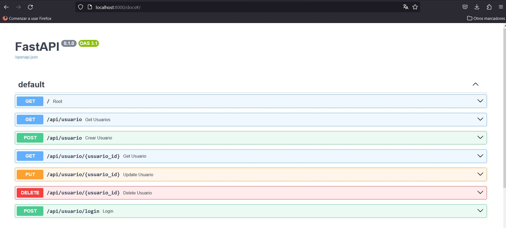

# fastAPI_usuarios

App construida con el framework de Python FastAPI.

---

ENDPOINTS: 
Mostrar usuarios: http://localhost:8000/api/usuario 
Mostrar un usuario: http://localhost:8000/api/usuario/{id} 
Registrar un usuario: http://localhost:8000/api/usuario 
Actualizar un usuario: http://localhost:8000/api/usuario/{id} 
Eliminar un usuario: http://localhost:8000/api/usuario/{id} 
Login: http://localhost:8000/api/usuario/login  

